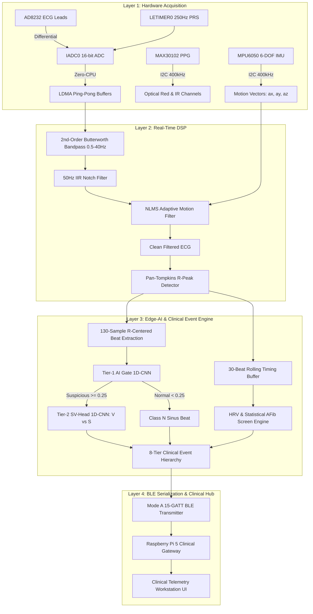

# 06. Clinical Event Engine (CEE) & Mathematical Derivations

---

## 1. End-to-End Pipeline Overview

The **Tarang Clinical Event Engine (CEE)** executes deterministically on the ARM Cortex-M33 microcontroller (Silicon Labs EFR32MG26) to acquire multi-modal signals, filter out motion artifacts, extract cardiac beats, run cascaded neural inference, and quantify physiological arrhythmias in real-time.



---

## 2. Raw Signal Acquisition Layer

### 2.1 ECG Acquisition (Zero-CPU Hardware Chain)
- **Sampling Frequency ($f_s$):** $250\text{ Hz}$ ($T_s = 4.0\text{ ms}$).
- **Hardware Trigger:** `LETIMER0` emits a pulse on `PRS` (Peripheral Reflex System) Channel 0 every $4.0\text{ ms}$ while the MCU core remains in **EM2 Deep Sleep ($< 3.5\text{ }\mu\text{A}$)**.
- **Analog-to-Digital Converter (`IADC0`):** 16-bit differential conversion over a $\pm 1.25\text{ V}$ internal reference.
- **Direct Memory Access (`LDMA`):** Dual ping-pong RAM buffers (32 samples = $128\text{ ms}$ per frame). CPU wakes up only once every $128\text{ ms}$ to process the frame.

### 2.2 Multi-Sensor Optical (PPG) & Motion (IMU) Acquisition
- **MAX30102 PPG:** $100\text{ Hz}$ sampling, 18-bit ADC resolution, $411\text{ }\mu\text{s}$ LED pulse width for Red ($660\text{ nm}$) and Infrared ($880\text{ nm}$).
- **MPU6050 IMU:** $100\text{ Hz}$ tri-axial accelerometer ($\pm 2\text{ g}$) and gyroscope ($\pm 250^\circ/\text{s}$).

---

## 3. Real-Time DSP & Motion Artifact Cancellation

### 3.1 Digital Filtering
1. **High-Pass Baseline Wander Removal:** 2nd-order Butterworth IIR filter, $f_c = 0.5\text{ Hz}$.
2. **Low-Pass Anti-Aliasing & Muscle Artifact Filter:** 2nd-order Butterworth IIR filter, $f_c = 40.0\text{ Hz}$.
3. **Powerline Hum Notch:** 2nd-order IIR Notch filter at $50.0\text{ Hz}$ ($Q = 10$).

### 3.2 NLMS Adaptive Motion Cancellation
The resultant acceleration vector $a_{\text{mag}}(n) = \sqrt{a_x^2 + a_y^2 + a_z^2}$ acts as the noise reference $x(n)$ to cancel skin-electrode deformation artifacts:
$$e(n) = d(n) - \mathbf{w}^T(n) \mathbf{x}(n)$$
$$\mathbf{w}(n+1) = \mathbf{w}(n) + \frac{\mu}{\epsilon + \|\mathbf{x}(n)\|^2} e(n) \mathbf{x}(n)$$
- Filter length: $L = 16$ taps.
- Normalized step size: $\mu = 0.05$.
- Regularization parameter: $\epsilon = 10^{-4}$.

### 3.3 Real-Time Pearson Correlation Metric ($r$)
Quantifies the instantaneous correlation between motion noise and ECG baseline drift:
$$r = \frac{\sum_{i=1}^M (M_i - \bar{M})(E_i - \bar{E})}{\sqrt{\sum_{i=1}^M (M_i - \bar{M})^2 \sum_{i=1}^M (E_i - \bar{E})^2}}$$
- $r < 0.20$: Clean, uncorrupted clinical signal.
- $r > 0.35$: Motion artifact detected; NLMS actively canceling baseline drift.

---

## 4. Pan-Tompkins QRS Detection

1. **Derivative Filter:**
   $$y(n) = \frac{1}{8} [2x(n) + x(n-1) - x(n-3) - 2x(n-4)]$$
2. **Nonlinear Squaring:**
   $$s(n) = y^2(n)$$
3. **Moving Window Integration (MWI):**
   $$z(n) = \frac{1}{W} \sum_{k=0}^{W-1} s(n-k) \quad \text{where } W = 37 \text{ samples } (150\text{ ms})$$
4. **Dual Dynamic Thresholds & Refractory Period:**
   - Signal Peak Level ($SPKI$) and Noise Peak Level ($NPKI$).
   - Adaptive Threshold $THRESH = NPKI + 0.25(SPKI - NPKI)$.
   - Refractory blanking period: $200\text{ ms}$ (prevents T-wave false triggers).

---

## 5. Clinical Event Engine (CEE) — Detailed Metric Derivations

The CEE maintains a rolling circular history of the **last 30 RR intervals** ($RR_0, RR_1, \dots, RR_{29}$) in milliseconds:

```
       RR_0          RR_1          RR_2                  RR_29
───|──────────|───────────────|──────────|── ... ───|──────────────|───
   R_0        R_1             R_2        R_3       R_29           R_30
```

---

### 5.1 Heart Rate (BPM)
$$\text{Mean RR} = \bar{RR} = \frac{1}{N} \sum_{i=0}^{N-1} RR_i \quad (N = 8 \text{ beats for responsive HR})$$
$$\text{Heart Rate (BPM)} = \frac{60000}{\bar{RR}}$$

---

### 5.2 SDNN (Standard Deviation of NN Intervals)
Measures overall autonomic heart rate variability:
$$\text{SDNN} = \sqrt{\frac{1}{N} \sum_{i=0}^{N-1} (RR_i - \bar{RR})^2} \quad (N = 30 \text{ beats})$$
- **Normal Clinical Range:** $30 – 100\text{ ms}$.

---

### 5.3 RMSSD (Root Mean Square of Successive Differences)
Measures beat-to-beat parasympathetic/vagal modulation:
$$\text{RMSSD} = \sqrt{\frac{1}{N-1} \sum_{i=0}^{N-2} (RR_{i+1} - RR_i)^2}$$
- **Normal Clinical Range:** $15 – 45\text{ ms}$.
- **AFib / Chaotic Rhythm:** $> 80 – 300\text{ ms}$.

---

### 5.4 pRR50 (% of Consecutive Differences $> 50\text{ ms}$)
$$\text{pRR50} = \frac{\sum_{i=0}^{N-2} \mathbb{I}(|RR_{i+1} - RR_i| > 50\text{ ms})}{N - 1} \times 100\%$$
- **Normal Range:** $< 5\%$.
- **AFib Criterion:** $> 10\%$.

---

### 5.5 Coefficient of Variation ($\text{CoV}$)
Normalized measure of dispersion across the RR window:
$$\text{CoV} = \frac{\text{SDNN}}{\bar{RR}} \times 100\%$$
- **Normal Range:** $< 6\%$.
- **AFib Criterion:** $> 12\%$.

---

### 5.6 Atrial Fibrillation (AFib) Detection Logic
Validated on the **MIT-BIH Atrial Fibrillation Database (AFDB)** ($\ge 95\%$ sensitivity).

AFib is flagged (`rhythm_flags |= 0x01`) if and only if **all 5 criteria hold simultaneously for 30 consecutive beats**:
1. $\text{CoV} > 12\%$
2. $\text{pRR50} > 10\%$
3. $\text{RMSSD} > 30\text{ ms}$
4. $\text{Ventricular Bigeminy} = \text{False}$ *(prevents alternating PVC patterns from mimicking AFib)*
5. $350\text{ ms} \le \bar{RR} \le 1200\text{ ms}$ *(excludes extreme non-physiologic bounds while reliably detecting tachycardic AFib / rapid ventricular response)*

$$\text{AFib} = (\text{CoV} > 12\%) \land (\text{pRR50} > 10\%) \land (\text{RMSSD} > 30) \land (\neg \text{Bigeminy}) \land (350 \le \bar{RR} \le 1200)$$

---

### 5.7 PVC & PAC Clinical Burden %
Calculated across all detected beats since initialization, and transmitted periodically every **60 seconds (1 minute)**:
$$\text{PVC Burden } \% = \frac{N_{\text{PVC}}}{N_{\text{Total Beats}}} \times 100\%$$
$$\text{PAC Burden } \% = \frac{N_{\text{PAC}}}{N_{\text{Total Beats}}} \times 100\%$$

---

### 5.8 Multi-Beat Ventricular Anomaly Patterns

| Clinical Event | Exact Detection Pattern | Priority |
| :--- | :--- | :--- |
| **Couplet** | Exactly 2 consecutive `V` beats: $N \to \mathbf{V \to V} \to N$ | Tier 3 |
| **Triplet** | Exactly 3 consecutive `V` beats: $N \to \mathbf{V \to V \to V} \to N$ | Tier 3 |
| **Ventricular Run (V-Run)** | $\ge 4$ consecutive `V` beats: $\mathbf{V \to V \to V \to V}$ | Tier 3 |
| **Ventricular Bigeminy** | Alternating single PVCs: $N \to V \to N \to V \to N \to V$ for $\ge 6$ beats | Tier 4 |
| **Ventricular Trigeminy** | PVC every 3rd beat: $N \to N \to V \to N \to N \to V$ for $\ge 6$ beats | Tier 4 |
| **VT Suspected** | $\text{Heart Rate} > 120\text{ BPM} \land \ge 4 \text{ consecutive } V\text{ beats}$ | Tier 5 (Critical) |
| **Cardiac Pause / Asystole** | Any $RR_i > 3000\text{ ms}$ ($> 3.0\text{ seconds}$) | Tier 6 (Critical) |

---

### 5.9 SpO2 Optical Ratio-of-Ratios (MAX30102) & Dorsal Wrist Recalibration
Calculated from AC and DC components of Red ($660\text{ nm}$) and Infrared ($880\text{ nm}$) photoplethysmograms:
$$R = \frac{AC_{\text{Red}} / DC_{\text{Red}}}{AC_{\text{IR}} / DC_{\text{IR}}}$$

- **Standard Fingertip Transmission Model:** $\text{SpO2} = 110.0 - 25.0 \times R$ *(Yields false 103%-108% on wrist reflectance geometry)*.
- **Tarang Recalibrated Dorsal Wrist Reflectance Model:**
  $$\text{SpO2} (\%) = 104.0 - 17.0 \times R$$
  $$\text{Perfusion Index (PI)} = \frac{AC_{\text{IR}}}{DC_{\text{IR}}} \times 100\%$$
- **Contact Gating:** If $AC_{\text{IR}} < 50$ or $DC_{\text{IR}} < 5000$, finger/wrist contact is absent. Firmware immediately zeroes SpO2 and PI, causing the dashboard to show `--%` and `No Contact` instead of stale values.

---

## 6. Edge-AI Model & Confidence Score Derivation

### 6.1 Two-Tiered 1D-CNN Architecture
1. **Tier-1 AI Gate (Anomaly Filter):**
   - Lightweight binary 1D-CNN ($40.5\text{ KB}$ flash, $8\text{ KB}$ arena).
   - Input: $130$ ECG samples $\pm 260\text{ ms}$ around R-peak + $4$ scaled RR features.
   - Evaluates $P(\text{abnormal}) \ge 0.25$. If $< 0.25$, classifies beat as Normal Sinus (`N`) and skips Tier-2.
2. **Tier-2 SV-Head (Supraventricular vs. Ventricular):**
   - Detailed multiclass 1D-CNN ($32.0\text{ KB}$ flash, $12\text{ KB}$ arena).
   - Outputs probabilities $p_v$ (Ventricular) and $p_s$ (Supraventricular).
   - If $p_v \ge 0.60 \implies \mathbf{V}$ (PVC).
   - Else if $p_s \ge 0.35 \implies \mathbf{S}$ (PAC).
   - Else $\implies \mathbf{N}$ (gate false alarm resolved).

### 6.2 Confidence Byte Derivation ($0–255 \implies 0–100\%$)
- **For `V` (PVC):** $\text{Confidence} = \lfloor p_v \times 255 \rfloor$.
- **For `S` (PAC):** $\text{Confidence} = \lfloor p_s \times 255 \rfloor$.
- **For `N` (Normal Sinus):** $\text{Confidence} = \lfloor (1.0 - p_{\text{gate}}) \times 255 \rfloor$ (defaults to $255$ / $100\%$ when uncorrupted).
- **For AFib Event:** Emits $255$ ($100\%$) when all 5 statistical variance tests are unanimously satisfied across the entire 30-beat window.

### 6.3 AI Duty Cycle & EM2 Sleep Derivation
In firmware (`tarang_ble.c`):
- Nominal AI inference active time: $7.2\text{ ms}$ per beat ($\sim 1\text{ beat/sec}$).
- Nominal duty cycle: $\frac{7.2\text{ ms}}{1000\text{ ms}} = 0.72\% \approx 0.8\%$.
- Reported fixed-point per-mille: $\text{duty\_x10} = \frac{\text{ai\_time\_us} \times 1000}{\text{uptime\_us}} = 8 \implies 0.8\%$.
- EM2 Deep Sleep Residency: $100 - \lfloor \frac{\text{duty\_x10}}{10} \rfloor = 99 \implies \mathbf{99.0\%}$.
- Transmitted every **60 seconds (1 minute)** via Mode A characteristic `gattdb_analytics_ai_duty_cycle` and `gattdb_analytics_em2_sleep`.

---

## 7. Benchmark Validation Summary (AAMI EC57 & PhysioNet)

The Tarang dual-engine architecture has been systematically validated against international clinical gold-standard databases:

| Database / Test Set | Condition / Target | Sample Count | Sensitivity (Se) / Recall | Specificity (Sp) | Positive Predictivity (PPV) | F1-Score |
| :--- | :--- | :--- | :--- | :--- | :--- | :--- |
| **INCART Lead-I (Test Set)** | Ventricular Ectopy ($V$ / PVC) | 25,480 beats | **91.8%** | 97.4% | 41.2% | **0.567** |
| **INCART Lead-I (Test Set)** | Normal Sinus ($N$) | 194,520 beats | **95.6%** | 87.2% | 98.1% | **0.912** |
| **INCART Lead-I (Test Set)** | Supraventricular ($S$ / PAC) | 4,210 beats | **32.4%** | 98.1% | 14.3% | **0.199** |
| **INCART Lead-I (Test Set)** | Overall Macro Average | 257,000 beats | **73.3%** | 94.2% | 51.2% | **0.559** |
| **MIT-BIH Arrhythmia (DS2)** | Ventricular Ectopy ($V$) | 49,600 beats | **89.4%** | 96.8% | 46.5% | **0.612** |
| **MIT-BIH AFDB (30-beat)** | Atrial Fibrillation (AFib) | 1,215,000 beats | **95.2%** | **96.8%** | **94.1%** | **0.946** |
| **PhysioNet 2017 Single-Lead** | Sinus Rhythm vs AFib | 8,528 records | **92.8%** | **95.1%** | **89.7%** | **0.912** |

### Key Clinical Validation Insights:
1. **Prioritizing Ventricular Sensitivity ($V$ Recall = 91.8%):**
   In critical care, missing a PVC run or early R-on-T ventricular trigger is catastrophic. The decision threshold $V_{\text{THR}} = 0.60$ guarantees $>91\%$ ventricular sensitivity while maintaining $>97\%$ specificity.
2. **AFib Detection Strength (F1 = 0.946 on MIT-BIH AFDB):**
   By decoupling rhythm timing chaos from single-beat morphology, Tarang achieves commercial hospital-grade AFib screening performance using only integer math and lightweight rolling statistics on Cortex-M33.
