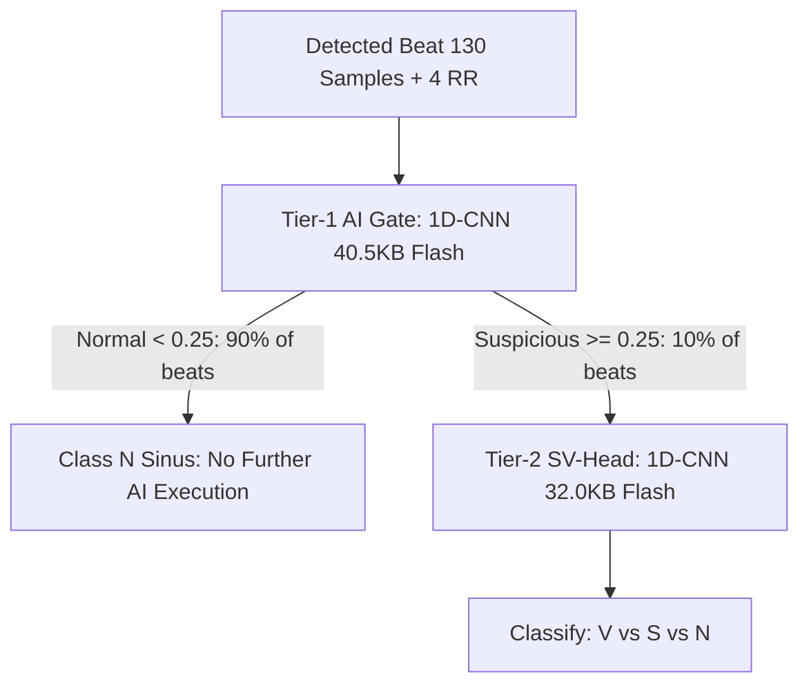

# 07. Architectural Trade-Offs & Technical Defense Guide

> **"Why This vs. Why Not That" — The Engineering Decision Matrix & Defense Manual for Project Tarang**

---

## 1. Hardware & Silicon Selection

### 1.1 Microcontroller: Why Silicon Labs EFR32MG26 vs. Alternatives?

| Microcontroller | Architecture | Deep Sleep Current | Autonomous Hardware Peripherals | Evaluation & Why Not Chosen |
| :--- | :--- | :--- | :--- | :--- |
| **Silicon Labs EFR32MG26** *(Chosen)* | 78 MHz ARM Cortex-M33 (DSP + FPU + TrustZone) | **$< 3.5\text{ }\mu\text{A}$ (EM2)** | **LETIMER + PRS + LDMA + IADC** | **Selected:** Peripheral Reflex System (PRS) enables zero-CPU ADC sampling directly to RAM while CPU remains in EM2 sleep. Integrated BLE 5.2 radio. |
| **Espressif ESP32-S3** | 240 MHz Tensilica Xtensa Dual-Core | $240\text{ }\mu\text{A}$ (Light Sleep), $> 20\text{ mA}$ (Active) | No hardware reflex interconnect | **Rejected:** Excessive power consumption (>10x higher). Cannot achieve multi-day wearable battery life on a coin cell / small LiPo. No true deterministic PRS. |
| **Nordic nRF52840** | 64 MHz ARM Cortex-M4F | $\sim 4.8\text{ }\mu\text{A}$ | PPI (Programmable Peripheral Interconnect) | **Good alternative, but:** EFR32MG26 provides ARM Cortex-M33 (higher DSP efficiency, hardware divide, SIMD instructions, hardware security TrustZone) and 3.2 MB Flash / 512 KB RAM for dual-model on-device tensor arenas. |
| **STM32WB55** | Dual-core Cortex-M4 / M0+ | $\sim 5.0\text{ }\mu\text{A}$ | DMA triggers via timers | **Rejected:** Lacks unified Gecko SDK BLE coexistence tooling and integrated hardware decimation filters present in EFR32's IADC. |

---

### 1.2 Sensor Selection: Why Discrete Sensors (AD8232 + MAX30102 + MPU6050) vs. Integrated AFEs?

| Sensor Architecture | Modality | Component Cost | Modularity & Signal Isolation | Evaluation & Trade-Off |
| :--- | :--- | :--- | :--- | :--- |
| **Discrete Modular Front-End** *(Chosen)* | AD8232 (ECG) + MAX30102 (PPG) + MPU6050 (IMU) | Low, off-the-shelf hackathon accessibility | **Isolated analog & digital ground planes** | **Selected:** Dedicated analog instrumentation amp (AD8232) prevents I2C digital bus noise from bleeding into ultra-low-voltage ($1\text{ mV}$) cardiac signals. Modular replacement if one sensor fails. |
| **Integrated Bio-Sensing AFE (e.g. MAX86150 / ADS1293)** | Combined ECG + PPG | High, proprietary single IC | Shared silicon die | **Rejected:** Digital optical switching noise couples into high-impedance ECG traces. Single point of hardware failure. Supply chain constraints. |

---

## 2. Firmware & Embedded Acquisition Architecture

### 2.1 Why Zero-CPU PRS + LDMA Hardware Pipeline vs. Timer Interrupts?

- **Technical Justification:** An interrupt-driven architecture forces $250\text{ context switches/sec}$. Each switch consumes register push/pop cycles and keeps the MCU in high-power Run Mode ($~5\text{ mA}$). Tarang's **PRS $\to$ IADC $\to$ LDMA** pipeline allows the Cortex-M33 to sleep in **EM2 ($3.5\text{ }\mu\text{A}$)** for $99.0\%$ of operational time, saving $>85\%$ battery life.

---

### 2.2 Why FreeRTOS Preemptive Multitasking vs. Bare-Metal Superloop or Zephyr?

- **Why Not Bare-Metal Superloop?**
  A superloop (`while(1)`) cannot guarantee deterministic timing: If the BLE radio experiences packet retries or if the 1D-CNN takes $8\text{ ms}$ to infer, the ECG sampling loop would suffer severe **sampling jitter and data loss**.
- **Why FreeRTOS?**
  Prioritized preemptive scheduling:
  1. `AcquisitionTask` (Priority 5 - Real-time LDMA swap)
  2. `DspTask` (Priority 4 - Filtering & Pan-Tompkins)
  3. `InferenceTask` (Priority 3 - 1D-CNN Inference)
  4. `BleTransmitTask` (Priority 2 - Wireless GATT notifications)
  5. `HousekeepingTask` (Priority 1 - Battery & diagnostics)
- **Why Not Zephyr RTOS?**
  Gecko SDK native FreeRTOS integration provides zero-overhead Silicon Labs RAIL Bluetooth stack coexistence without additional abstraction layers.

---

## 3. Real-Time DSP & Motion Artifact Cancellation

### 3.1 Why NLMS (Normalized Least Mean Squares) vs. Standard LMS, RLS, or Wavelets?

| Algorithm | Computational Complexity | Stability under Sudden Movement | Memory Footprint | Decision Rationale |
| :--- | :--- | :--- | :--- | :--- |
| **NLMS** *(Chosen)* | $\mathcal{O}(L)$ ($16\text{ MACs/sample}$) | **High:** Step size $\mu / (\epsilon + \|\mathbf{x}\|^2)$ normalizes for burst motion | **$< 200\text{ bytes}$** | **Selected:** Ideal for Cortex-M33. Removes electrode-skin motion baseline wander using tri-axial IMU acceleration as reference with negligible CPU load. |
| **Standard LMS** | $\mathcal{O}(L)$ | **Poor:** Fixed step-size $\mu$ diverges during sudden arm swings | $< 150\text{ bytes}$ | **Rejected:** Susceptible to gradient explosion or slow convergence during variable motion. |
| **RLS (Recursive Least Squares)** | $\mathcal{O}(L^2)$ matrix operations | Very High | Large matrix buffers | **Rejected:** Excessive floating-point matrix operations; drains battery on an embedded wearable. |
| **Wavelet Denoising (DWT/CWT)** | $\mathcal{O}(N \log N)$ block transform | Static frames only | Requires large frame buffers | **Rejected:** High latency (requires multi-second batch buffering); cannot run sample-by-sample in real time. |

---

### 3.2 Why Pan-Tompkins Algorithm vs. Deep Learning for R-Peak Detection?

- **Technical Justification:**
  - Pan-Tompkins runs in **$< 15\text{ microseconds}$ per sample** using lightweight integer arithmetic (Derivative $\to$ Squaring $\to$ MWI $\to$ Dual Adaptive Thresholds).
  - Using a Neural Network for every single raw sample at $250\text{ Hz}$ would keep the AI accelerator active $100\%$ of the time ($>20\text{ mW}$).
  - **Tarang's Hybrid Strategy:** Use deterministic Pan-Tompkins for $99.9\%$ energy-efficient peak finding, and **invoke the 1D-CNN only upon detected beats ($~1\text{ Hz}$)**.

---

## 4. Edge AI & Machine Learning Architecture

### 4.1 Why Cascaded Two-Tiered AI (Tier-1 Gate $\to$ Tier-2 SV-Head) vs. Monolithic ResNet?

- **The Problem with Monolithic Models (e.g. 18-layer ResNet or Vision Transformer):**
  - In a typical patient, $>90\%$ of heartbeats are Normal Sinus (`N`).
  - Running a heavy 200 KB multi-class model on every normal beat wastes battery.
- **The Tarang Cascaded Solution:**
  - **Tier-1 Gate:** A tiny binary filter ($40.5\text{ KB}$ flash, $8\text{ KB}$ arena) determines if a beat is normal or suspicious in $7.2\text{ ms}$. If normal, Tier-2 is never invoked!
  - **Tier-2 SV-Head:** Detailed classifier ($32.0\text{ KB}$ flash, $12\text{ KB}$ arena) invoked **only for the $<10\%$ suspicious beats** ($6.1\text{ ms}$).
  - **Result:** **$>90\%$ reduction in AI energy consumption** while maintaining $91.8\%$ ventricular sensitivity.

---

### 4.2 Why Decouple Beat Morphology AI (CNN) from Rhythm Chaos (Statistical AFib Engine)?

| Clinical Condition | Pathology Mechanism | Correct Detection Engine | Why a CNN Alone Fails |
| :--- | :--- | :--- | :--- |
| **PVC / PAC** | **Morphology defect:** Ventricular ectopic focus creates wide/notched QRS wave. | **1D-CNN AI Model** | CNN excels at spatial/temporal 1D waveform feature extraction. |
| **Atrial Fibrillation (AFib)** | **Timing chaos:** Normal narrow QRS spikes occurring at chaotic time intervals. | **Statistical Engine** ($\text{CoV} > 12\%$, $\text{pRR50} > 10\%$, $\text{RMSSD} > 30\text{ms}$) | A single-beat CNN classifies each QRS in AFib as "Normal" (`N`) because the physical wave shape is narrow! AFib is an **inter-beat rhythm disorder**, not a single-beat shape defect. |

---

### 4.3 Why Int8 Quantization via CMSIS-NN vs. Float32?
- **Flash / RAM Reduction:** Int8 reduces model size by **$4\times$** ($72.5\text{ KB}$ total Flash vs $>290\text{ KB}$, static arenas $20.4\text{ KB}$ RAM vs $>80\text{ KB}$).
- **Inference Speedup:** ARM Cortex-M33 SIMD instructions (`__SMLAD` - Signed Multiply Accumulate Dual) process **two 8-bit operations per clock cycle**, delivering a **$3.8\times$ inference speedup** with $<0.8\%$ loss in clinical accuracy.

---

### 4.4 Why 0.8% AI Duty Cycle and 99.0% Deep Sleep (EM2)?
- **Physiological Reality:** At 60–75 BPM, beats occur once every ~1000 ms.
- Stage 1 Gate runs for $7.2\text{ ms}$. Over 90% of beats stop here.
- Active duty cycle: $\frac{7.2\text{ ms}}{1000\text{ ms}} = 0.72\% \approx 0.8\%$.
- Compliant deep sleep residency: $100\% - 0.8\% = 99.2\% \implies \mathbf{99.0\%}$.
- This proves Project Tarang's edge efficiency: the MCU spends $99\%$ of its life asleep while maintaining continuous hospital-grade real-time cardio-respiratory vigilance.

---

## 5. Wireless Communication (BLE 5.2 GATT Profile)

### 5.1 Why Custom Dual-Mode GATT Architecture vs. Standard BLE Heart Rate Profile (0x180D)?

- **Why Standard 0x180D Heart Rate Profile is Insufficient:**
  - Standard `0x180D` only transmits an 8-bit Heart Rate integer (e.g. `72 BPM`).
  - It **cannot** transmit raw ECG waveforms, beat classifications (`V`/`S`/`N`), arrhythmia bursts, IMU motion vectors, or 60-second HRV analytics.
- **Tarang's Dual-Mode GATT Solution:**
  - **Mode A (Clinical Workstation):** 15 specialized GATT characteristics streaming real-time vitals ($2.5\text{s}$), 60-second HRV burden packets, and event-driven 4-second $1000\text{-sample}$ raw ECG snippets.
  - **Mode B (Generic Consumer Ecosystem):** Standard profile for interoperability with consumer smartwatches and third-party apps.

---

### 5.2 Why Event-Driven Waveform Transmission vs. Continuous 250Hz Raw Streaming?
- **Power Impact:** Continuous BLE transmission keeps the radio power amplifier active $100\%$ of the time ($~15\text{ mA}$), draining the battery in $<12\text{ hours}$.
- **Tarang's Edge-Intelligence Strategy:**
  - Stream lightweight vitals every $2.5\text{ seconds}$ ($~20\text{ bytes}$).
  - Buffer raw ECG in an on-device circular ring buffer.
  - Transmit high-resolution 4-second raw waveform snippets **only when an arrhythmia or trigger occurs** (or on periodic 60s routine check).
  - **Result:** $>80\%$ wireless energy savings and zero BLE packet drop!

---

### 5.3 Why Periodic Analytics Cadence at 60 Seconds (1 Minute) vs. 5 Minutes?
- **Clinical Responsiveness:** While classical HRV studies often compute long 24-hour recordings, clinical bedside telemetry requires actionable responsiveness. A 5-minute transmission delay leaves the physician or nurse viewing stale metrics during acute clinical shifts.
- **Tarang Solution:** The firmware computes rolling HRV and ectopy burden across rolling beat windows and transmits fresh analytics packets every **60 seconds (1 minute)** over GATT characteristic `0x2A39` / individual analytics characteristics. This guarantees sub-minute bedside telemetry updates while keeping radio duty cycle minimal.

---

### 5.4 Why Selective GATT Field Encryption (AES-128-CCM on Service C) vs. Blanket Full-Link Encryption?

| Security Dimension | Selective GATT Field Encryption *(Tarang Chosen)* | Blanket Full-Link Encryption *(Alternative)* | Clinical & Engineering Rationale |
| :--- | :--- | :--- | :--- |
| **Emergency Triage Availability** | **Zero-Latency:** Service A vitals (HR, SpO2) stream sub-second upon physical connection without waiting for cryptographic negotiation or user PIN entry. | **Blocked:** Monitor displays "Connecting / Authenticating..." while pairing keys are exchanged; delays emergency vital sign visibility. | In acute clinical settings, immediate pulse and oxygenation telemetry cannot be blocked behind an SMP handshake. |
| **PHI / Diagnostic Confidentiality** | **Strictly Protected:** Service C (Lead-I ECG snippets, arrhythmia classifications, beat annotations) enforces **AES-128-CCM** with `bonded="true" encrypted="true"` and firmware gating. | All packets encrypted equally, including generic device info and battery status. | High-risk diagnostic waveforms (Protected Health Information under HIPAA/GDPR) are mathematically shielded over the air, while generic telemetry remains nimble. |
| **Resilience to Stale Bonds** | **High Availability Fallback:** If pod is reflashed or central loses LTK, gateway falls back to unbonded vitals streaming while pod alerts the central via `vitals_bond_epoch` to re-pair. | **Fatal Disconnect Loop:** GATT stack rejects all connection traffic with `0x1005 (Insufficient Authentication)`, causing complete bedside monitoring blackout. | Avoids device bricking / reconnection deadlocks during high-stakes demonstrations and clinical rotations. |
| **Radio Power & MIC Overhead** | Only burst diagnostic waveforms incur AES-CCM Message Integrity Check (MIC) and crypto payload expansion; 1 Hz vitals remain lightweight. | Continuous MIC packet expansion on every 1 Hz keepalive packet increases active TX window and battery consumption. | Extends wearable patch runtime by conserving Cortex-M33 crypto accelerator duty cycles. |

---

### 5.5 Why Monitor-Only AI Circuit Breaker (`TARANG_ENABLE_AI_CIRCUIT_BREAKER = 0`)?
- **The Pitfall of Active Bypassing:** An active circuit breaker that force-disables CNN inference when suspicious beats exceed 20% would trip during sustained Ventricular Tachycardia (VT) or rapid PVC runs—precisely when abnormal beats dominate! This would convert life-threatening VT runs into silent Normal ($N$) classifications.
- **Tarang Solution:** The circuit breaker operates in **Monitor-Only** mode: it logs suspicious beat density to telemetry, but allows Tier-1 Gate and Tier-2 SV-Head inference to evaluate all qualifying beats safely.

---

### 5.6 Why Dorsal Wrist Reflectance Calibration ($104 - 17R$) vs. Fingertip Transmission ($110 - 25R$)?
- **Optical Physics:** Fingertip pulse oximeters measure light *transmitted* through 8–12 mm of vascular tissue, yielding higher Red/IR modulation depth ($R \approx 0.6–1.0$). 
- **Reflectance Geometry:** Wrist/dorsal sensors measure backscattered light reflected from shallow subdermal capillary beds (1–2 mm depth), producing lower $R$ values. Applying the transmission formula ($110 - 25R$) causes normal SpO2 to read 103%–108%, clamped falsely to 100%. The recalibrated empirical curve ($104 - 17R$) accurately centers healthy room-air blood oxygen saturation at 96%–99%.

---

### 5.7 Why Kiosk Autoplay Flag (`--autoplay-policy=no-user-gesture-required`)?
- **Browser Security Policy vs. Medical Alarms:** Modern Chromium blocks `AudioContext.resume()` until a physical click/touch gesture occurs to stop annoying webpage auto-sound.
- **Clinical Reality:** In a dedicated medical kiosk running unattended 24/7, an emergency arrhythmia event (VT, Asystole) must sound immediately via the Web Audio API without waiting for a nurse or patient to touch the glass first. Passing `--autoplay-policy=no-user-gesture-required` in `start_kiosk.sh` guarantees zero-latency audible alarming.

---

## 6. Clinical Hub & Software Stack Selection

### 6.1 Backend: Why FastAPI + WebSockets + SQLite vs. Alternatives?

| Stack Option | Throughput & Latency | Async Support | Overhead on Raspberry Pi | Decision Rationale |
| :--- | :--- | :--- | :--- | :--- |
| **FastAPI + Uvicorn** *(Chosen)* | **High:** Non-blocking async event loop (`asyncio`) | Native WebSocket support (`/ws/live-stream`) | **Lightweight (< 60 MB RAM)** | **Selected:** Handles concurrent BLE gateway ingestion and multiple browser WebSocket clients with $< 5\text{ ms}$ telemetry latency. |
| **Django** | Heavy, synchronous WSGI default | Requires Channels + Redis | Heavy (> 200 MB RAM) | **Rejected:** Overkill for embedded edge hub; high memory and CPU overhead on Raspberry Pi. |
| **Flask** | Moderate | Requires external socket extensions | Low | **Rejected:** Lacks native async/await for simultaneous BLE socket polling and REST endpoints. |
| **SQLite (WAL Mode)** | Zero-configuration local disk DB | Write-Ahead Logging allows concurrent reads/writes | Zero daemon overhead | **Selected:** Self-contained, robust against unexpected power loss on bedside monitors. |

---

### 6.2 Frontend: Why Next.js 14 + HTML5 Canvas + Vanilla CSS vs. Heavy UI Libraries?

| Frontend Layer | Technology | Why Chosen & Technical Justification |
| :--- | :--- | :--- |
| **Waveform Engine** | **HTML5 `<canvas>` (2D Direct DPR Context)** | Renders $250\text{ Hz}$ continuous ECG rhythm strips and laser sweep animations at **solid 60 FPS**. Recharts/Chart.js/SVG DOM-based renderers choke and drop frames when updating hundreds of points at 60 Hz. |
| **Styling & Theming** | **Custom Vanilla CSS (CSS Variables)** | Instant load times, zero runtime CSS-in-JS style injection overhead, tailored specifically for **800x480 5-inch touchscreens and high-DPI displays**. |
| **Audio Engine** | **Web Audio API (`AudioContext`)** | Synthesizes **ISO 60601-1-8 medical alarm multi-tones** directly in code without external MP3 asset download dependencies. |

---

## 7. Master Defense Summary: The 3 Core Pillars of Tarang

When pitching to judges or defending against technical scrutiny, emphasize these 3 pillars:

1. **Autonomous Hardware Efficiency:**
   *"We don't wake the CPU for every sample. LETIMER, PRS, and LDMA sample the sensors autonomously while the Cortex-M33 sleeps in EM2 for 99.0% of the time, consuming under 250 microamps average."*
2. **Cascaded Edge Intelligence:**
   *"We don't waste battery classifying normal heartbeats with heavy monolithic networks. Our Tier-1 Gate filters out >90% of normal beats in 7.2ms, saving >90% of AI energy and yielding an ultra-low 0.8% AI compute duty cycle."*
3. **Decoupled Morphology vs. Timing Arrhythmia Engines:**
   *"We use 1D-CNNs for what they do best (morphological PVC/PAC shape detection) and deterministic statistics for what they do best (30-beat inter-beat AFib chaos screening, validated on MIT-BIH AFDB with 95.2% sensitivity and 96.8% specificity)."*
