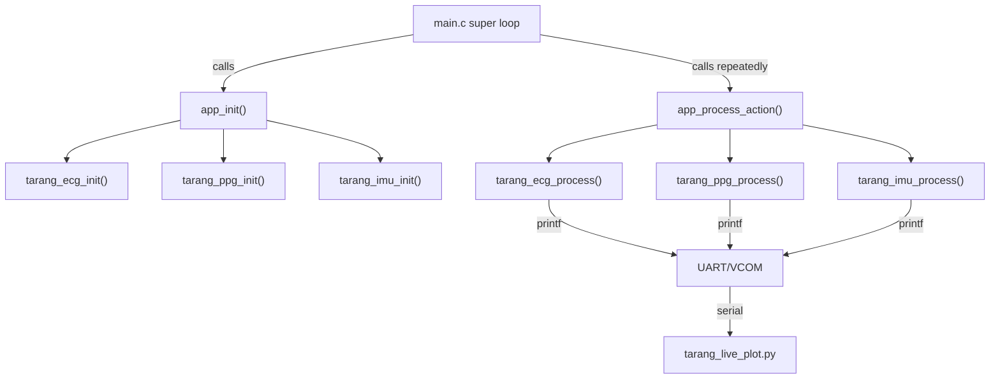

# TARANG Sensor Data Flow Analysis & PPG Bug Report

## Architecture Overview



---

## Shared Resources Between Sensors

> [!IMPORTANT]
> PPG and IMU **share the same I2C bus** (`sl_i2cspm_mikroe`). This is the most likely cause of PPG failure when both are enabled.

| Resource | ECG | PPG | IMU | Conflict? |
|---|---|---|---|---|
| **I2C bus** (`sl_i2cspm_mikroe`) | ✗ | ✅ | ✅ | ⚠️ **YES — bus contention** |
| GPIO Interrupt dispatcher (`GPIOINT`) | ✗ | ✅ pin 6 | ✅ pin 0 | No (different pins) |
| `CMU_ClockEnable(cmuClock_GPIO)` | ✗ | ✅ (called again redundantly) | ✗ | No |
| `GPIOINT_Init()` | ✗ | ✅ (called again redundantly) | ✗ | ⚠️ See below |
| LETIMER0 | ✅ | ✗ | ✗ | No |
| PRS channel 2 | ✅ | ✗ | ✗ | No |
| IADC0 | ✅ | ✗ | ✗ | No |
| DMADRV | ✅ | ✗ | ✗ | No |
| UART/printf | ✅ | ✅ | ✅ | ⚠️ bandwidth (see below) |

---

## Per-Sensor Data Flow Detail

### 1. ECG — LETIMER → PRS → IADC → DMA → RAM

| Property | Value |
|---|---|
| **Sample rate** | ~250 Hz (LFRCO 32768 / COMP0=131) |
| **Bits per sample** | 32 bits stored, but **24 bits valid** (masked `& 0x00FFFFFF`) |
| **ADC resolution** | IADC 12-bit natively, but register read is 32-bit `SINGLEFIFODATA` |
| **Buffer** | `ecg_buffer[128]` — two halves of 64 samples each (`ECG_HALF_SAMPLES=64`) |
| **Buffer size** | 128 × 4 bytes = **512 bytes RAM** |
| **Data lifetime** | Ping-pong: each half is **overwritten** every 64 samples (~256 ms). Old data is gone. |
| **Overrun detection** | Yes — `ecg_overrun_count` incremented if CPU hasn't drained a half before DMA refills it |
| **Output to UART** | 1 sample per super-loop pass, every 4th sample (`stream_idx += 4`), so effective UART rate = ~62 Hz |
| **Past data** | **Destroyed** — DMA continuously overwrites the same 128-sample ring. No history kept on MCU. |

**Data path:**
```
LETIMER0 underflow pulse (250 Hz)
  → PRS async ch2
    → IADC0 single conversion trigger
      → DMA ping-pong → ecg_buffer[0..63] / ecg_buffer[64..127]
        → tarang_ecg_process() prints 1-in-4 samples via printf
```

---

### 2. PPG — MAX30102 I2C interrupt-driven

| Property | Value |
|---|---|
| **Sample rate** | ~100 Hz (set by MAX30102 SPO2_CONFIG `0x27` = 100 sps, 18-bit ADC, 411µs pulse) |
| **Bits per sample** | **18 bits valid** per channel (masked `& 0x0003FFFF`), stored in 32-bit `uint32_t` |
| **Channels** | 2 (RED + IR), 3 bytes each = **6 bytes per FIFO read** |
| **Buffer** | `ppg_red_buffer[1024]` + `ppg_ir_buffer[1024]` — circular ring buffers |
| **Buffer size** | 1024 × 4 × 2 = **8192 bytes RAM** |
| **Data lifetime** | Circular: wraps at index 1024, oldest sample overwritten. Holds ~10.24 seconds at 100 Hz. |
| **Interrupt pin** | PC06, falling edge → `ppg_data_ready = true` |
| **Max drain per service** | 8 samples per `tarang_ppg_process()` call |
| **Past data** | Ring buffer on MCU (last 1024 samples). But **only `red_sample`/`ir_sample` (latest values) are exposed** via accessors. The buffer exists but is NEVER read by anyone. |

**Data path:**
```
MAX30102 generates PPG_RDY interrupt at 100 Hz
  → PC06 falling edge → GPIO ISR → sets ppg_data_ready=true
    → tarang_ppg_process():
        1. Read INT_STATUS1/2 (clear interrupt)
        2. Read FIFO (6 bytes: 3B RED + 3B IR)
        3. Unpack 18-bit big-endian samples
        4. Store in ring buffer + update red_sample/ir_sample
        5. printf every 100 samples or when >1 drained
```

---

### 3. IMU — MPU6050 I2C interrupt-driven

| Property | Value |
|---|---|
| **Sample rate** | 100 Hz (SMPLRT_DIV=9 → 1 kHz / 10 = 100 Hz) |
| **Bits per sample** | 6 × 16-bit axes = **96 bits** (plus 16-bit temp = 112 bits total per burst) |
| **Accel range** | ±2g (ACCEL_CONFIG=0x00), resolution 16384 LSB/g |
| **Gyro range** | ±250°/s (GYRO_CONFIG=0x00), resolution 131 LSB/°/s |
| **Buffer** | **NO buffer** — only the latest `accel_x/y/z` and `gyro_x/y/z` are kept (scalar variables) |
| **Buffer size** | 6 × 2 bytes = **12 bytes** of live data (no history) |
| **Interrupt pin** | PC00, rising edge → `imu_data_ready = true` |
| **Burst read** | 14 bytes from register 0x3B (accel[6] + temp[2] + gyro[6]) |
| **Past data** | **Completely destroyed** — only the last sample exists on MCU. |

**Data path:**
```
MPU6050 DATA_RDY interrupt at 100 Hz
  → PC00 rising edge → GPIO ISR → sets imu_data_ready=true
    → tarang_imu_process():
        1. Read INT_STATUS register (clears interrupt)
        2. Burst read 14 bytes from 0x3B
        3. Unpack 6 int16_t values (ax, ay, az, temp, gx, gy, gz)
        4. Overwrite scalar variables
        5. printf every 100 samples
```

---

## Summary: Data Storage Comparison

| Sensor | Bits per sample | Rate | Buffer type | Buffer depth | History on MCU | What's exposed |
|---|---|---|---|---|---|---|
| **ECG** | 24-bit (in 32-bit word) | 250 Hz | Ping-pong DMA (2×64) | 128 samples | ~0.5 sec | Buffer pointer + latest half |
| **PPG** | 18-bit × 2 ch (in 32-bit) | 100 Hz | Circular ring ×2 | 1024 samples | ~10.2 sec | Only latest RED/IR scalars |
| **IMU** | 16-bit × 6 axes | 100 Hz | **None** (scalars only) | 1 sample | **ZERO** | Latest ax/ay/az/gx/gy/gz |

---

## 🐛 PPG Bug Analysis — Why It's Not Working

### Bug 1: `GPIOINT_Init()` called TWICE — may wipe IMU's callback

In [tarang_ppg.c:260](file:///c:/MMDPublic/Hackathons/TeamOcelleon/projects/tarang-firmware/Integration/tarang_ppg.c#L260), PPG init calls `GPIOINT_Init()` again, even though app.c already called it at [app.c:68](file:///c:/MMDPublic/Hackathons/TeamOcelleon/projects/tarang-firmware/Integration/app.c#L68).

The init order in [app.c](file:///c:/MMDPublic/Hackathons/TeamOcelleon/projects/tarang-firmware/Integration/app.c#L78-L94) is:
1. `GPIOINT_Init()` (line 68)
2. `tarang_ppg_init()` (line 80) — calls `GPIOINT_Init()` **again** (line 260)
3. `tarang_imu_init()` (line 89)

If `GPIOINT_Init()` clears the callback table on re-init, it would wipe any previously registered callbacks. Since PPG is initialized BEFORE IMU, the second `GPIOINT_Init()` inside PPG doesn't hurt IMU (IMU registers after). But this is still wrong and fragile.

> [!WARNING]
> **This is NOT the primary PPG bug** — the redundant `GPIOINT_Init()` doesn't directly break PPG since no callbacks are registered before PPG init. But it should be removed.

### Bug 2 (PRIMARY): I2C Bus Contention Between PPG and IMU

Both PPG (MAX30102 at 0x57) and IMU (MPU6050 at 0x68) use `sl_i2cspm_mikroe`. The I2C bus is **not protected by any mutex**. Here's the race:

1. PPG interrupt fires (100 Hz) → sets `ppg_data_ready = true`
2. IMU interrupt fires (100 Hz) → sets `imu_data_ready = true`  
3. `app_process_action()` calls `tarang_ppg_process()` which starts an I2C transaction to MAX30102
4. **Meanwhile**, `tarang_imu_process()` may start an I2C transaction to MPU6050 on the SAME bus
5. Since both run in the super-loop (not interrupts), they actually execute sequentially — so this is NOT the issue in the default code path.

Actually wait — in the super-loop they DO run sequentially. Let me re-examine...

### Bug 3 (ACTUAL PRIMARY): PPG printf output is GATED — samples only print every 100th sample or on multi-drain

Looking at [tarang_ppg.c:385-392](file:///c:/MMDPublic/Hackathons/TeamOcelleon/projects/tarang-firmware/Integration/tarang_ppg.c#L385-L392):

```c
if ((drained > 1u) || ((ppg_sample_count != 0u) && ((ppg_sample_count % 100u) == 0u))) {
    printf("[PPG] cnt=%lu int=%lu RED=%lu IR=%lu drained=%u\r\n", ...);
}
```

**PPG only prints a line every 100 samples (once per second)** or when multiple samples are drained in one pass. Compare this to:
- ECG: prints 1 sample every super-loop tick (~62 Hz stream)
- IMU: prints every 100 samples too, but at least the diagnostic block in `app.c` prints the latest values every 2 seconds

### Bug 4: PPG data reaches the live plot **only through the diagnostic block in app.c**

The live plot parses `[PPG] samples=N RED=N IR=N sensor=OK|FAIL` from the diagnostic block in [app.c:182-201](file:///c:/MMDPublic/Hackathons/TeamOcelleon/projects/tarang-firmware/Integration/app.c#L182-L201). But the regex in [tarang_live_plot.py:89-91](file:///c:/MMDPublic/Hackathons/TeamOcelleon/projects/tarang-firmware/Integration/tarang_live_plot.py#L89-L91) also matches the `cnt=` format from `tarang_ppg_process()`:

```python
RE_PPG = re.compile(r"\[PPG\]\s+(?:samples|cnt)=(\d+)\s+.*RED=(\d+)\s+IR=(\d+)")
```

So the Python side can parse both formats. But PPG data only gets emitted:
- Once every 100 samples from `tarang_ppg_process()` 
- Once every ~2 seconds from `app.c` diagnostics

**This means the live plot gets at most ~1-2 PPG data points per second**, compared to ECG's ~62 Hz. The PPG plot will look dead/flat.

### Bug 5: Diagnostic timebase is ECG-first — with ECG disabled, PPG drives diagnostics

With `TARANG_ENABLE_ECG=0`, the diagnostic interval uses PPG's sample_count ([app.c:137-139](file:///c:/MMDPublic/Hackathons/TeamOcelleon/projects/tarang-firmware/Integration/app.c#L137-L139)). This works correctly if PPG is actually producing samples. If PPG is stuck (I2C issues), diagnostics never print.

### Bug 6: Potential I2C failure cascade

If the MAX30102 isn't responding (bad wiring, wrong I2C instance), the recovery logic in [tarang_ppg.c:131-156](file:///c:/MMDPublic/Hackathons/TeamOcelleon/projects/tarang-firmware/Integration/tarang_ppg.c#L131-L156) calls `sl_i2cspm_init_instances()` which **reinitializes ALL I2C instances** — this could disrupt an ongoing IMU transaction.

---

## What "Not Working" Likely Means

Given your current config (`ECG=0, PPG=1, IMU=1`):

1. **If PPG shows `FAILED` at init** → MAX30102 isn't responding on I2C. Check wiring to the MikroE header (PC05=SDA, PC07=SCL).

2. **If PPG shows `OK` at init but RED=0 IR=0** → sensor is found but FIFO reads are returning zeros. Could be:
   - LED current too low (`0x24` = ~7.2mA, try `0x7F` = ~25.4mA for testing)
   - FIFO config issue
   - No finger/object on sensor

3. **If PPG shows OK with non-zero values but the live plot shows nothing** → The data rate to the plot is too low (1 point/sec). The plot works but looks empty.

4. **If PPG works alone but fails when IMU is also enabled** → I2C bus contention during recovery (`sl_i2cspm_init_instances()` reinits everything).

---

## Recommendations

1. **Remove redundant `GPIOINT_Init()` and `CMU_ClockEnable(cmuClock_GPIO)`** from [tarang_ppg.c:252](file:///c:/MMDPublic/Hackathons/TeamOcelleon/projects/tarang-firmware/Integration/tarang_ppg.c#L252) and [tarang_ppg.c:260](file:///c:/MMDPublic/Hackathons/TeamOcelleon/projects/tarang-firmware/Integration/tarang_ppg.c#L260) — app.c already handles both.

2. **Add per-sample PPG printf** (like ECG does) so the live plot gets real-time data.

3. **Check your I2C wiring** — tell me what you see on the serial output and I can narrow it down further.
