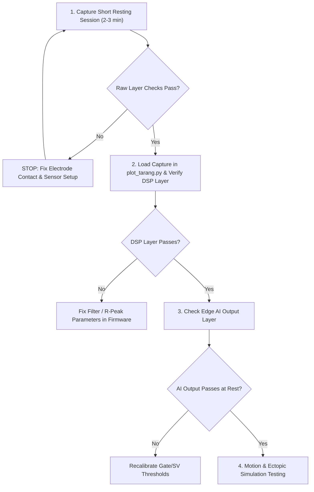

# Step-by-Step Sensor Reading Verification & Validation Guide (Standard Lead I)

This guide provides a practical, step-by-step protocol for biomedical hardware, DSP, and firmware engineers to verify whether telemetry readings (ECG, PPG, IMU) recorded by the **TARANG** board represent **true physiological human signals** and meet concrete healthtech pass conditions.

> [!IMPORTANT]
> **ECG Lead Configuration**: TARANG DSP & Edge AI models are trained and validated specifically on **Standard ECG Lead I**:
> - **Positive Lead ($+$)**: Left Arm (LA) / Left Wrist
> - **Negative Lead ($-$)**: Right Arm (RA) / Right Wrist
> - **Ground / Reference (RL)**: Right Leg (RL) / Driven Right Leg (DRL) ground
> - **Potential Difference**: $V_{\text{Lead I}} = V_{\text{LA}} - V_{\text{RA}}$

---

## 3-Layer Verification & Validation Framework

### 1. Raw Data Layer (Gating Criteria)

> [!CAUTION]
> **Gate for everything downstream**: If raw data fails any check below, do NOT test DSP or Edge AI layers. Fix electrode/sensor contact first.

| Check | How | Pass Condition |
|---|---|---|
| **Sample Rate** | Count samples per second from `timestamp_ms` deltas | **ECG**: $250 \pm 2\text{ Hz}$. **IMU/PPG**: $100 \pm 2\text{ Hz}$ |
| **No Dropped Frames** | Check `tarang_diagnostics_t.dropped_frames` and `dma_overruns` | Both stay at **0** over the capture duration |
| **Timestamp Monotonicity** | Diff consecutive `timestamp_ms` values | Strictly increasing, consistent step size. Gaps bigger than expected represent dropped samples (must be visible, not smoothed over) |
| **ADC Baseline Sanity** | Look at raw ECG value distribution | Sits near midpoint (e.g. $2^{23} = 8,388,608$ for 24-bit, or $500 - 3500\text{ LSB}$ for 12-bit), swinging a few thousand counts. Pegged near 0 or max = disconnected/shorted electrode |
| **Not Flatlined** | Visual inspection on raw trace | Periodic signal present. Flat line or pure noise = no real contact |
| **Visible QRS Periodicity** | Visual inspection on raw trace | Eyeball repeating bumps matching actual resting heart rate, prior to any filtering |
| **IMU Baseline** | Check 3-axis accelerometer at rest | Exactly one axis reads $\sim 1g$ (confirms correct orientation, not floating noise) |
| **PPG Pulsatility** | Check RED/IR optical baseline | Small periodic AC pulse component riding on DC baseline when finger is present. Flat line = no finger contact |

---

### 2. DSP Processed Data Layer

| Check | How | Pass Condition |
|---|---|---|
| **Golden Vector Match** | Run raw capture through Python reference DSP (`tarang_dsp_reference.py`) and compare stage-by-stage vs firmware | Max absolute error $< 10^{-4}$ (per Section 6.2 of integration doc) — definitive proof of algorithm correctness |
| **R-Peak Alignment** | Overlay detected R-peak markers on raw trace | Markers land within a few samples of visible QRS peak on every beat (zero misses at rest) |
| **RR Interval Range** | Inspect `rr_prev_ms` values | $600 - 1200\text{ ms}$ for normal resting sinus. Values outside this window indicate arrhythmia or detection bug |
| **Z-Score Normalization** | Check processed amplitude distribution over 30s rolling window | Mean $\approx 0$, Std $\approx 1$ once window is filled |
| **Baseline Wander Removal**| Compare raw vs bandpassed trace | Processed trace shows zero low-frequency drift (0.5–40 Hz bandpass verified) |
| **Signal Quality (SQI)** | Check `signal_quality` field | High ($> 128$) during good contact, drops visibly during deliberate lead-off/motion |
| **NLMS Artifact Suppression**| Compare raw vs processed amplitude during motion window | **Deferred — NLMS requires PCB, not applicable to current breadboard/dev-board captures.** (Skipped for dev-board testing) |

---

### 3. Edge AI Output Layer

| Check | How | Pass Condition |
|---|---|---|
| **Gate Trigger Rate** | Fraction of beats where Gate CNN runs (Tier 0 flagged suspicious) | $< 5\%$ at rest |
| **SV Trigger Rate** | Fraction of beats where SV Head runs (Gate flagged) | $< 1\%$ at rest |
| **Gate $P(\text{abnormal})$** | Plot probability trace over session | Flat/low at rest ($< 0.25$), only spikes on genuine ectopics or real artifact bursts |
| **Morphology Sanity** | Pull up 130-sample window for V or S beats | V beats show wide/bizarre PVC shape; S beats show early narrow PAC shape. Normal QRS classified as V indicates miscalibration |
| **No False Rhythm Flags**| Monitor `rhythm_flags` during calm resting session | Remains `NORMAL` — zero spurious AFib/VT/bigeminy triggers |
| **HR Cross-Check** | Manual pulse count ($30\text{s} \times 2$) vs `current_hr` | Within $\pm 2\text{ BPM}$ |
| **HRV Population** | Inspect `sdnn_ms`, `rmssd_ms`, `prr50_pct` | Populates non-zero values starting at the 30th valid beat |
| **Ectopic Tap Test** | Tap electrode to simulate premature/bizarre beat | Triggers Tier-0 suspicious $\rightarrow$ Gate fires $\rightarrow$ gets classified, lining up exactly with tap on raw layer |

---

## The Sequential Verification Workflow

Do tests in order, rather than all three layers in parallel:

1. **Resting Session First**: Capture 2–3 minutes at rest. Pass raw checks before proceeding.
2. **DSP Validation**: Run `plot_tarang.py` and verify filter outputs, R-peak alignment, and Z-score normalization.
3. **AI Output Check**: Confirm Gate/SV trigger rates stay $< 5\%$ and $< 1\%$ at rest with zero false rhythm flags.
4. **Motion & Simulation**: Execute deliberate motion/tap tests to exercise the Gate/SV cascade (**Note**: NLMS artifact suppression is deferred until PCB hardware arrives; zero suppression is expected on breadboard).

---

# TARANG — What to Save in the CSV (Consolidated Schema)

This is the single reference for what needs to be in your telemetry CSVs so
you can actually run the Raw / DSP / AI verification checks and the two
debugging scripts (golden-vector DSP comparison, TFLite mismatch check)
without having to re-capture data because a column was missing.

> [!IMPORTANT]
> **File Naming Convention**: Name your CSV files using the timestamp and test identifier format:
> - Sample Stream: `<timestamp>_Test<N>_samples.csv` (e.g. `20260812_100000_Test1_samples.csv`)
> - Beat Stream: `<timestamp>_Test<N>_beats.csv` (e.g. `20260812_100000_Test1_beats.csv`)

**Use two files per session, not one** — ECG/IMU/PPG run at different
native rates (250Hz / 100Hz / 100Hz), and cramming them into one row-per-
250Hz-tick file means resampling IMU/PPG to match ECG, which is exactly the
"don't resample, don't interpolate over gaps" rule from the plotting-tool
spec. Two files, one shared time base (`timestamp_ms`), joined by nearest-
timestamp when you need to correlate across them — not merged into a single
frequency.

---

## File 1: `<timestamp>_Test<N>_samples.csv` — per-sample stream (250Hz rate, ECG-driven)

One row every ECG sample tick.

| Column | Type | Needed for | Why |
|---|---|---|---|
| `sample_idx` | uint32 | **DSP layer, AI debug script** | **You're currently missing this.** Without it you can't slice the exact 130-sample window back out of the CSV to feed into the TFLite mismatch script — you'd have to reconstruct it from timestamps and guess at off-by-one alignment. Add it now. |
| `timestamp_ms` | uint32 | Raw layer (sample rate, monotonicity, gaps) | The actual clock, not an assumed fixed step — this is what makes a dropped frame visible as a jump instead of invisible |
| `ecg_raw` | int32 (24-bit range) | Raw layer (baseline sanity, flatline check) | Untouched ADC counts |
| `ecg_bandpassed` | float | DSP layer (golden-vector comparison, baseline-wander check) | Output of the 0.5–40Hz Butterworth stage |
| `ecg_zscored` | float | DSP layer (normalization sanity), **AI debug script (this is what actually gets fed to the model)** | Rolling 30s z-score output — the CNN's actual ECG input |
| `mwi_output` | float | DSP layer (R-peak detection sanity) | Moving-window-integrator signal — lets you see *why* a peak did or didn't cross threshold |
| `threshold_th1` | float | DSP layer (adaptive threshold behavior) | Confirms SPKI/NPKI/TH1 dynamics look sane, especially useful for chasing the earlier tail-end-beat-drop issue if it recurs on real data |
| `ecg_valid` | bool/0-1 | Raw layer, sensor-failure handling | Per-sensor liveness flag — lets the plot render a dropout band instead of plotting stale/frozen values as if live |
| `imu_ax`, `imu_ay`, `imu_az` | float (g) | Raw layer (IMU baseline), DSP layer (correlate motion with artifact) | Nearest-past IMU sample at this ECG timestamp — note this is a *lookup*, not a resample; don't interpolate between real IMU samples |
| `imu_valid` | bool/0-1 | Raw layer, sensor-failure handling | Same liveness pattern as `ecg_valid` |
| `ppg_red`, `ppg_ir` | uint32 | Raw layer (pulsatility check) | Nearest-past PPG sample, same lookup-not-resample rule |
| `ppg_valid` | bool/0-1 | Raw layer, sensor-failure handling | Same liveness pattern |

**Note on `imu_*`/`ppg_*` in this file:** since IMU/PPG run at 100Hz and this file is ECG-rate (250Hz), most rows will repeat the same IMU/PPG values until the next real 100Hz sample arrives — that's expected and fine, it's a nearest-past lookup, not a resample, and it's why `imu_valid`/`ppg_valid` matter: they tell you whether the value you're looking at is fresh or just held from the last real reading.

---

## File 2: `<timestamp>_Test<N>_beats.csv` — per-beat event stream (sparse — one row per detected beat)

| Column | Type | Needed for | Why |
|---|---|---|---|
| `timestamp_ms` | uint32 | All layers — this is the join key back to `session_samples.csv` | |
| `r_peak_sample_idx` | uint32 | **AI debug script** | Lets you slice `[sample_idx-65 : sample_idx+65]` out of File 1's `ecg_zscored` column to reconstruct the exact beat window |
| `rr_prev_ms` | float | DSP layer (RR range check), AI debug script (model input) | |
| `rr_mean_5_ms` | float | AI debug script (model input) | |
| `rr_std_5_ms` | float | AI debug script (model input) | |
| `local_hr_bpm` | float | AI debug script (model input) | |
| `signal_quality` | uint8 (0-255) | DSP layer (SQI check) | |
| `gate_p_abnormal` | float | AI layer (trigger rate, threshold behavior), AI debug script (ground truth to compare against) | Raw probability, not just the boolean "did it fire" — you need the actual number to compare against the Python re-run |
| `sv_p_v`, `sv_p_s` | float, nullable | AI layer, AI debug script | Null/blank when Gate didn't fire — don't default to 0.0, that's indistinguishable from "SV Head ran and returned exactly 0" |
| `beat_class` | uint8 (N/S/V/Q) | AI layer (morphology sanity, classification review) | |
| `confidence` | uint8 (0-255) | AI layer | |
| `rhythm_flags` | uint8 bitfield | Clinical layer (false-flag check) | |
| `current_hr` | uint8 | Clinical layer (HR cross-check) | |
| `sdnn_ms`, `rmssd_ms`, `prr50_pct` | uint16/uint8 | Clinical layer (HRV population check) | Will read 0 until the 30th valid beat — that's expected, not a bug, per the earlier fix |
| `pac_burden_pct`, `pvc_burden_pct` | uint8 | Clinical layer | Already in your 16-byte BLE packet struct — free to include here too |

---

## Two things to double check before your next capture, not after

1. **`sample_idx` is the one confirmed gap** — everything else above may already exist in some form depending on what your `TARANG_DEBUG_TELEMETRY` path currently prints; audit against this table and add whatever's missing before recording your next real session, not after you've got a folder of sessions you can't fully debug.
2. **`sv_p_v`/`sv_p_s` must be nullable/blank, not zero-filled**, when the Gate didn't fire — a zero here is ambiguous between "SV Head ran and output 0.0" and "SV Head never ran," and you'll want to tell those apart when computing SV trigger rate or debugging a specific beat.

---

## Quick map: which file(s) each verification step actually reads

| Verification step | Reads |
|---|---|
| Raw layer checks (Section 1 of the validation guide) | `session_samples.csv` only |
| DSP layer checks, golden-vector comparison | `session_samples.csv` only |
| AI layer checks (trigger rates, false flags, HR/HRV) | `session_beats.csv` only |
| AI debug script (TFLite mismatch check) | **Both** — `ecg_zscored` + `sample_idx` from File 1, `r_peak_sample_idx` + `rr_*` + `gate_p_abnormal`/`sv_p_*` from File 2, joined on the beat's sample index |
| Motion-artifact / ectopic-tap correlation (visual, cross-layer) | **Both**, plotted on a shared timestamp x-axis |

