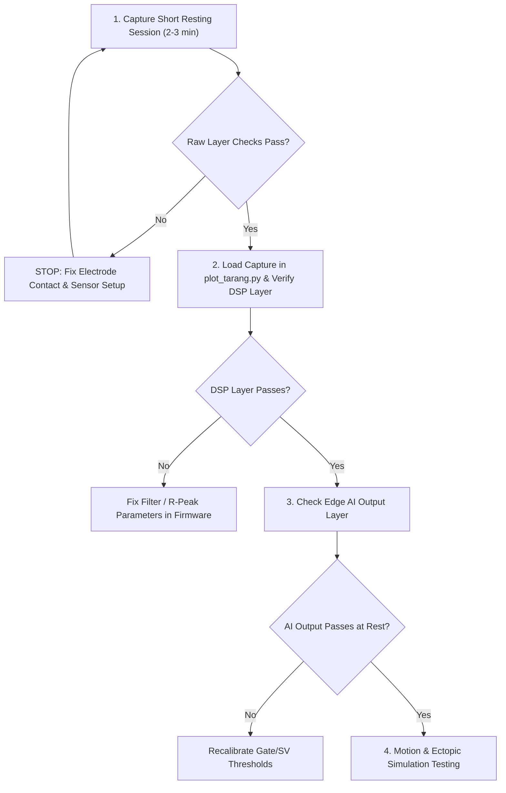

# Step-by-Step Sensor Reading Verification & Validation Guide (Standard Lead I)

This guide provides a practical, step-by-step protocol for biomedical hardware, DSP, and firmware engineers to verify whether telemetry readings (ECG, PPG, IMU) recorded by the **TARANG** board represent **true physiological human signals** and meet concrete healthtech pass conditions.

> [!IMPORTANT]
> **ECG Lead Configuration**: TARANG DSP & Edge AI models are trained and validated specifically on **Standard ECG Lead I**:
> - **Positive Lead ($+$)**: Left Arm (LA) / Left Wrist
> - **Negative Lead ($-$)**: Right Arm (RA) / Right Wrist
> - **Ground / Reference (RL)**: Right Leg (RL) / Driven Right Leg (DRL) ground
> - **Potential Difference**: $V_{\text{Lead I}} = V_{\text{LA}} - V_{\text{RA}}$

---

## 3-Layer Verification & Validation Framework

### 1. Raw Data Layer (Gating Criteria)

> [!CAUTION]
> **Gate for everything downstream**: If raw data fails any check below, do NOT test DSP or Edge AI layers. Fix electrode/sensor contact first.

| Check | How | Pass Condition |
|---|---|---|
| **Sample Rate** | Count samples per second from `timestamp_ms` deltas | **ECG**: $250 \pm 2\text{ Hz}$. **IMU/PPG**: $100 \pm 2\text{ Hz}$ |
| **No Dropped Frames** | Check `tarang_diagnostics_t.dropped_frames` and `dma_overruns` | Both stay at **0** over the capture duration |
| **Timestamp Monotonicity** | Diff consecutive `timestamp_ms` values | Strictly increasing, consistent step size. Gaps bigger than expected represent dropped samples (must be visible, not smoothed over) |
| **ADC Baseline Sanity** | Look at raw ECG value distribution | Sits near midpoint (e.g. $2^{23} = 8,388,608$ for 24-bit, or $500 - 3500\text{ LSB}$ for 12-bit), swinging a few thousand counts. Pegged near 0 or max = disconnected/shorted electrode |
| **Not Flatlined** | Visual inspection on raw trace | Periodic signal present. Flat line or pure noise = no real contact |
| **Visible QRS Periodicity** | Visual inspection on raw trace | Eyeball repeating bumps matching actual resting heart rate, prior to any filtering |
| **IMU Baseline** | Check 3-axis accelerometer at rest | Exactly one axis reads $\sim 1g$ (confirms correct orientation, not floating noise) |
| **PPG Pulsatility** | Check RED/IR optical baseline | Small periodic AC pulse component riding on DC baseline when finger is present. Flat line = no finger contact |

---

### 2. DSP Processed Data Layer

| Check | How | Pass Condition |
|---|---|---|
| **Golden Vector Match** | Run raw capture through Python reference DSP (`tarang_dsp_reference.py`) and compare stage-by-stage vs firmware | Max absolute error $< 10^{-4}$ (per Section 6.2 of integration doc) — definitive proof of algorithm correctness |
| **R-Peak Alignment** | Overlay detected R-peak markers on raw trace | Markers land within a few samples of visible QRS peak on every beat (zero misses at rest) |
| **RR Interval Range** | Inspect `rr_prev_ms` values | $600 - 1200\text{ ms}$ for normal resting sinus. Values outside this window indicate arrhythmia or detection bug |
| **Z-Score Normalization** | Check processed amplitude distribution over 30s rolling window | Mean $\approx 0$, Std $\approx 1$ once window is filled |
| **Baseline Wander Removal**| Compare raw vs bandpassed trace | Processed trace shows zero low-frequency drift (0.5–40 Hz bandpass verified) |
| **Signal Quality (SQI)** | Check `signal_quality` field | High ($> 128$) during good contact, drops visibly during deliberate lead-off/motion |
| **NLMS Artifact Suppression**| Compare raw vs processed amplitude during motion window | Processed trace shows visibly reduced motion artifact amplitude |

---

### 3. Edge AI Output Layer

| Check | How | Pass Condition |
|---|---|---|
| **Gate Trigger Rate** | Fraction of beats where Gate CNN runs (Tier 0 flagged suspicious) | $< 5\%$ at rest |
| **SV Trigger Rate** | Fraction of beats where SV Head runs (Gate flagged) | $< 1\%$ at rest |
| **Gate $P(\text{abnormal})$** | Plot probability trace over session | Flat/low at rest ($< 0.25$), only spikes on genuine ectopics or real artifact bursts |
| **Morphology Sanity** | Pull up 130-sample window for V or S beats | V beats show wide/bizarre PVC shape; S beats show early narrow PAC shape. Normal QRS classified as V indicates miscalibration |
| **No False Rhythm Flags**| Monitor `rhythm_flags` during calm resting session | Remains `NORMAL` — zero spurious AFib/VT/bigeminy triggers |
| **HR Cross-Check** | Manual pulse count ($30\text{s} \times 2$) vs `current_hr` | Within $\pm 2\text{ BPM}$ |
| **HRV Population** | Inspect `sdnn_ms`, `rmssd_ms`, `prr50_pct` | Populates non-zero values starting at the 30th valid beat |
| **Ectopic Tap Test** | Tap electrode to simulate premature/bizarre beat | Triggers Tier-0 suspicious $\rightarrow$ Gate fires $\rightarrow$ gets classified, lining up exactly with tap on raw layer |

---

## The Sequential Verification Workflow

Do tests in order, rather than all three layers in parallel:

1. **Resting Session First**: Capture 2–3 minutes at rest. Pass raw checks before proceeding.
2. **DSP Validation**: Run `plot_tarang.py` and verify filter outputs, R-peak alignment, and Z-score normalization.
3. **AI Output Check**: Confirm Gate/SV trigger rates stay $< 5\%$ and $< 1\%$ at rest with zero false rhythm flags.
4. **Motion & Simulation**: Execute deliberate motion/tap tests to exercise the NLMS filter and Gate/SV cascade.
|
